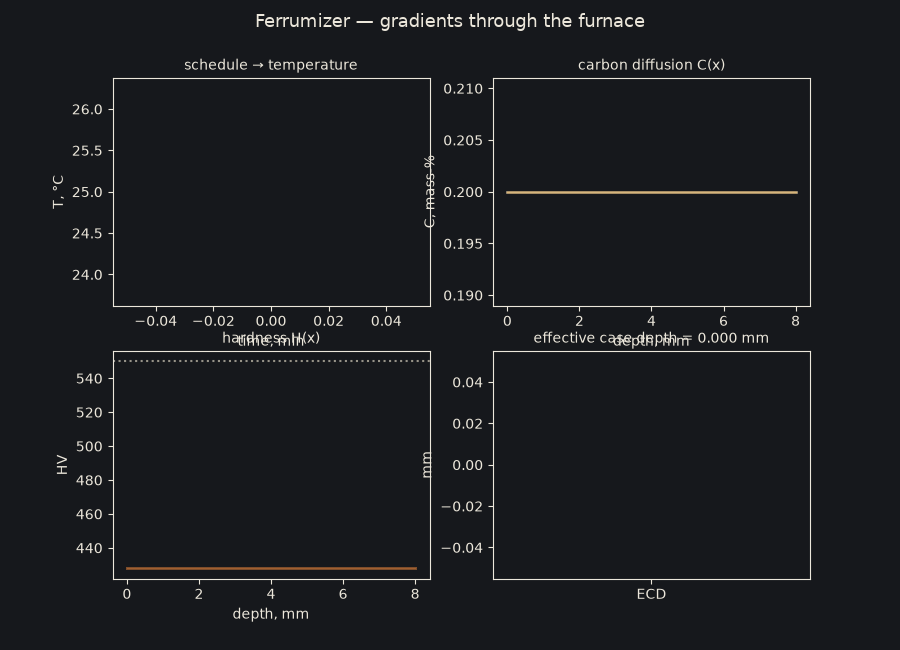
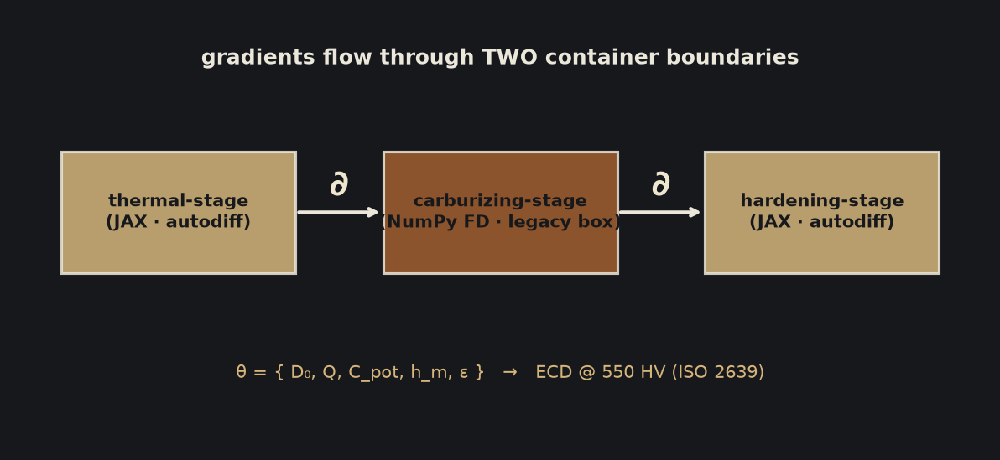
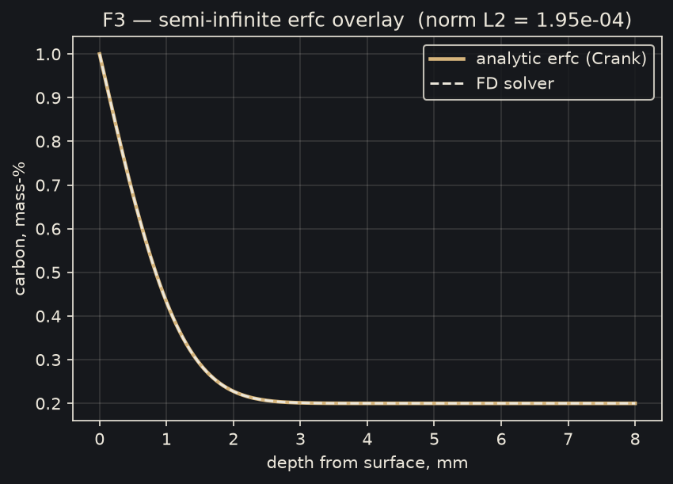
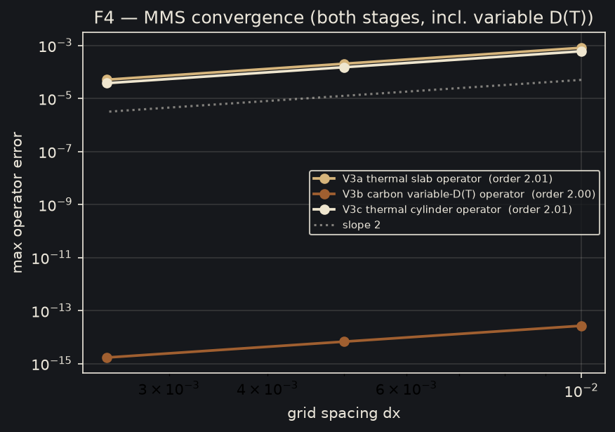
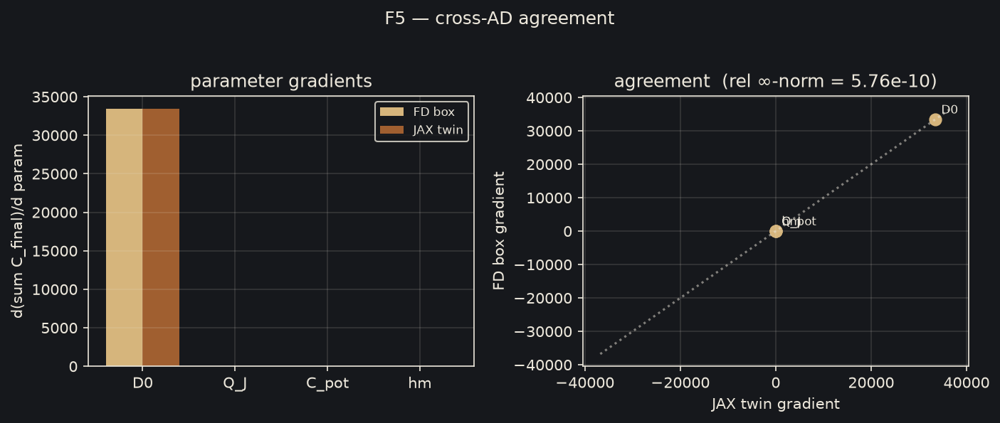
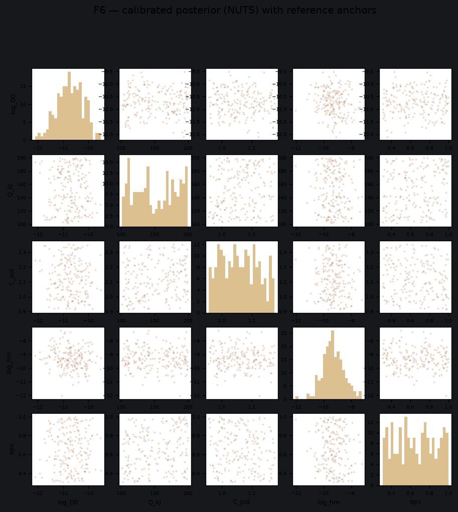
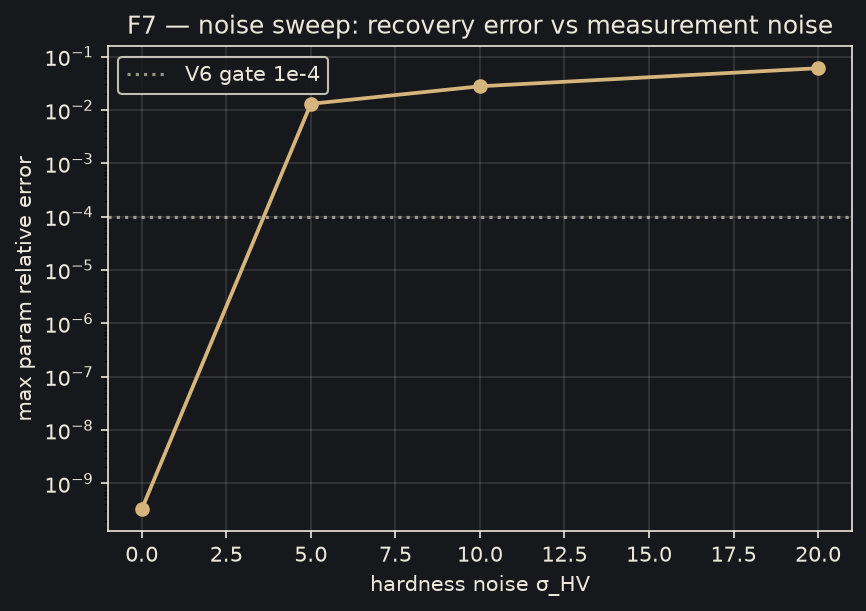
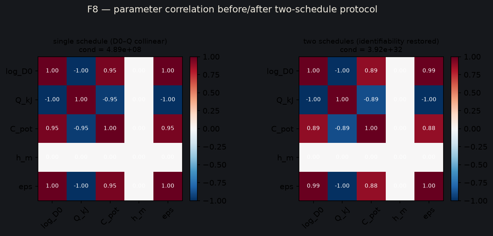
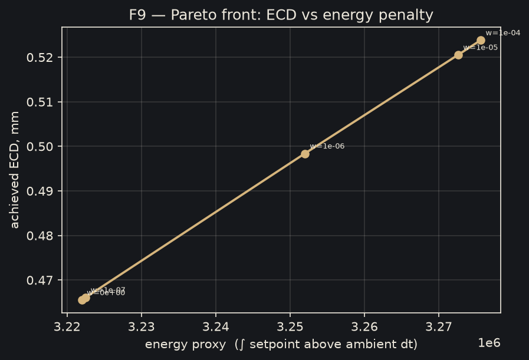
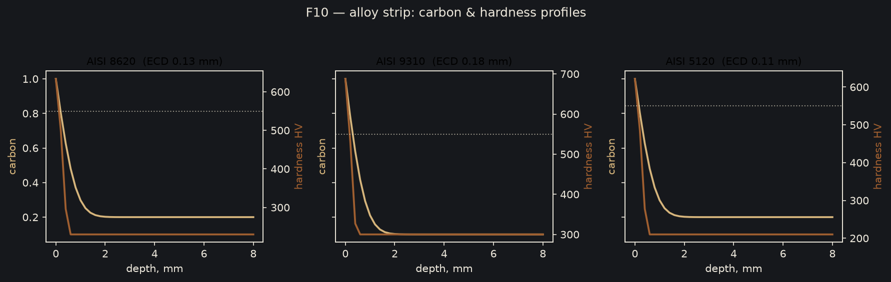

# ferrumizer

[](https://www.python.org/)
[](LICENSE)
[](docs/verification.md)
[](https://github.com/Idle0x/ferrumizer)

> **Gradients through the furnace.**
> A differentiable heat-treatment engine for gas carburizing, from furnace
> schedule to thermal history, carbon diffusion, phase transformation,
> hardness, and effective case depth.

Ferrumizer is a **Tesseract Hackathon 2026** submission for
**Track 04 — Differentiable Inference & UQ**, with a cross-track contribution
to **Track 02 — Multi-Physics & Coupled Systems**.

The pipeline composes three independently executable Tesseract components
into a single differentiable workflow:

```
furnace schedule → thermal history → carbon profile → hardness → ECD
```

End-to-end differentiation enables two inverse workflows:

1. **Calibration** — infer process parameters from measured hardness
   traverses using Bayesian inference and quantify posterior uncertainty.
2. **Inverse design** — optimize a furnace schedule for a target effective
   case depth, optionally penalizing energy consumption.

Ferrumizer is a **process emulator**, not a commercial finite-element or CFD
package. It uses documented one-dimensional approximations and
literature-anchored parameters for fast simulation, calibration,
optimization, and methodological validation.

For reproduction, see [docs/reproducing.md](docs/reproducing.md); for the
design choices and rationale, see
[docs/design-rationale.md](docs/design-rationale.md).

---

## Table of contents

1. [Overview](#overview)
2. [Motivation](#motivation)
3. [Architecture](#architecture)
4. [Tesseract integration](#tesseract-integration)
5. [Quickstart](#quickstart)
6. [Interfaces](#interfaces)
7. [Capabilities](#capabilities)
8. [Figures and validation](#figures-and-validation)
9. [Glossary](#glossary)
10. [Physics model](#physics-model)
11. [Verification](#verification)
12. [Reproducibility](#reproducibility)
13. [Extending Ferrumizer](#extending-ferrumizer)
14. [Limitations](#limitations)
15. [Future work](#future-work)
16. [Repository layout](#repository-layout)
17. [Documentation](#documentation)
18. [Citation and license](#citation-and-license)

---

## Overview

Gas carburizing is a heat-treatment process used to harden the surface of
low-carbon steel components such as gears, shafts, and bearings while
retaining a tougher core. The part is held in a carbon-rich atmosphere,
typically at approximately 900–1050 °C, allowing carbon to diffuse into the
surface. A subsequent quench transforms the carbon-enriched austenite into
hard martensite.

The primary engineering output is **effective case depth (ECD)**: the depth
at which hardness falls below 550 HV, following ISO 2639.

Ferrumizer models this process as a single differentiable pipeline:

```
furnace schedule → T(x,t) → C(x,t) → H(x) → ECD
```

The stages are differentiable with respect to process and model parameters
including emissivity, diffusion prefactor `D₀`, activation energy `Q`,
carbon potential `C_pot`, and mass-transfer coefficient `h_m`. Gradients can
therefore propagate from the final hardness profile back through the
complete process model.

This supports two inverse problems:

- **Calibration**: estimate effective furnace parameters from measured
  hardness traverses, including Bayesian posterior uncertainty.
- **Inverse design**: determine a furnace schedule that achieves a specified
  ECD, with an optional energy penalty.

The model is intentionally transparent about its scope. Approximations and
parameter provenance are documented in [docs/physics.md](docs/physics.md)
and the architecture decision records in
[docs/architecture.md](docs/architecture.md).

---

## Motivation

Conventional carburizing-cycle development is largely empirical: run a
cycle, measure the resulting part, adjust the process, and repeat. Each
iteration requires furnace time, material, and measurement.

Several properties of the problem make this workflow difficult to optimize
manually:

- **Multiple coupled process variables.** Temperature, soak time, carbon
  potential, boost/diffuse timing, and quench conditions jointly influence
  ECD.
- **Furnace-specific parameters.** Effective diffusion and heat-transfer
  behavior varies with furnace, load geometry, atmosphere, and operating
  condition.
- **Limited measurements.** A hardness traverse provides only a small number
  of observations from an expensive physical experiment.

Differentiability turns the forward model into an inverse-modeling tool.
Instead of repeatedly adjusting a schedule by trial and error, gradients can
be used to optimize process parameters and schedules directly. Bayesian
inference can likewise use the model to estimate uncertain process parameters
from measured data.

### Finite differences and automatic differentiation

The carbon-diffusion stage intentionally supports two implementations:

- a legacy NumPy finite-difference implementation, whose parameter Jacobian
  is computed by central finite differences; and
- a numerically equivalent JAX implementation, whose derivatives are obtained
  through automatic differentiation.

The NumPy implementation remains the forward computational path for the
legacy component. The JAX implementation provides an independent derivative
reference.

This distinction creates a genuine finite-difference/autodiff implementation
boundary within the composed pipeline. Verification gate V4 compares the two
derivative paths, while V4c checks end-to-end gradients after containerized
composition.

---

## Architecture

Ferrumizer is composed of three independently buildable Tesseract components:

```
┌──────────────────────────┐      ┌──────────────────────────┐      ┌──────────────────────────┐
│      thermal-stage       │      │     carburizing-stage    │      │     hardening-stage      │
│   JAX, explicit FTCS     │      │  NumPy FD + JAX twin     │      │   JAX phase/hardness     │
│   conduction + Robin BC  │ ───► │  carbon diffusion       │ ───► │   transformation model   │
│   T(x,t)                 │ T_s  │  C(x,t)                 │ C_f  │   H(x), ECD              │
└──────────────────────────┘      └──────────────────────────┘      └──────────────────────────┘
        ▲                                    ▲                                    ▲
        └──────────────────── end-to-end gradients, ∂ECD/∂θ ─────────────────────┘
```

Each component resides under [`components/`](components/) and provides:

- `tesseract_api.py` — the InputSchema, OutputSchema, and `apply` contract;
- `tesseract_config.yaml` — container configuration; and
- component-specific tests.

### 1. Thermal stage

[`components/thermal-stage`](components/thermal-stage) implements
one-dimensional heat conduction using JAX and an explicit FTCS scheme with
stability enforcement.

The boundary conditions include convective and radiative heat transfer using
Robin boundary conditions.

### 2. Carburizing stage

[`components/carburizing-stage`](components/carburizing-stage) models carbon
diffusion using Fick's law with Arrhenius temperature dependence:

```
D(T) = D₀ · exp(−Q / RT)
```

The stage supports Dirichlet and mass-transfer boundary conditions.

Its forward computation is implemented in NumPy, with parameter derivatives
computed by central finite differences. A numerically equivalent JAX
implementation provides an automatic-differentiation reference.

### 3. Hardening stage

[`components/hardening-stage`](components/hardening-stage) converts the
carbon and thermal histories into phase fractions, hardness, and ECD using:

- Andrews martensite-start temperature;
- Koistinen–Marburger martensite kinetics;
- Scheil-additivity JMAK for diffusional transformations;
- smoothstep hardness mixing; and
- ISO 2639 ECD.

### Pipeline composition

The stages are composed in
[`app/ferrumize/pipeline.py`](app/ferrumize/pipeline.py).

Two execution paths are available:

- `FerrumizerPipeline.forward()` — the pure-JAX execution path used by
  calibration, design, figures, and the application.
- `FerrumizerPipeline.forward_containers()` — the containerized Tesseract
  path, which routes the computation through the three components using
  `tesseract_jax.apply_tesseract`.

The two paths produce results that agree to floating-point tolerance. V4c
verifies gradient propagation through the containerized composition.

---

## Tesseract integration

Tesseract provides the execution boundary between the independently developed
physics components.

**Why Tesseract for this project:**

The three stages have different computational characteristics:

- the thermal stage is JAX-native;
- the carburizing stage preserves a legacy NumPy finite-difference
  implementation alongside its JAX reference; and
- the hardening stage is JAX-native.

This separation provides three benefits.

**Independent execution.** Each stage has its own schema, environment, tests,
and container configuration.

**Implementation isolation.** The calibration and design workflows depend on
the component contract rather than importing implementation details from the
carburizing solver.

**Differentiable composition.** The complete pipeline can be differentiated
across the component boundaries. V4 verifies agreement between the FD and
autodiff derivative paths; V4c verifies finite, non-zero end-to-end gradients
through the containerized composition.

The Tesseract architecture is therefore part of the computational design, not
simply a packaging layer.

**Why Track 04 (Differentiable inference & UQ):**

the rubric explicitly names
this track as "an expensive or black-box solver wrapped as a Tesseract and
dropped into a probabilistic workflow for Bayesian calibration... the solver
may expose its Jacobian by autodiff or by finite differences; the composition
with the inference engine is the contribution." That is precisely the
architecture here: NumPyro NUTS over a Tesseract-wrapped solver that exposes
its Jacobian both ways. Cross-track 02 because the pipeline is inherently
multi-physics (thermal → carbon → hardening) and the inverse problem spans
all three stages.

**Why not another approach:**

a monolithic JAX reimplementation of all three
stages would be simpler to write but would *remove the boundary* — the thing
the competition rewards. A commercial-FE wrapper (e.g. PyMAPDL/ANSYS, which
won 2025) would be impressive but closed, heavy, and unverifiable in a
hackathon window. The chosen design keeps the legacy box honest, the gradients
provable, and the whole thing reproducible on a laptop.

Find out more about the tesseract integration and design choices in: [docs/reproducing.md](docs/reproducing.md) and [docs/design-rationale.md](docs/design-rationale.md).

---

## Quickstart

```bash
git clone https://github.com/Idle0x/ferrumizer.git
cd ferrumizer

uv tool install -e . --with streamlit    # puts `ferrumize` on PATH, no activation
uv sync --extra app --extra dev --extra docs   # full dev environment (tests, docs)

ferrumize verify --fast
ferrumize verify

ferrumize figures
ferrumize app
```

The two setup lines are independent:

- `uv tool install -e . --with streamlit` makes `ferrumize` available in every
  shell without activation. `-e` installs the package editable, so code edits
  are picked up without reinstalling; `--with streamlit` pulls the app
  dependency, which is an optional extra rather than a core requirement.
- `uv sync --extra app --extra dev --extra docs` builds the development venv
  (the extras are disjoint, so include all three for a complete setup). It
  is also the fallback path: if `ferrumize` is not found after the tool
  install, run `source .venv/bin/activate` — the venv contains the same CLI.

The synthetic datasets under `data/` are committed, so nothing else is needed
before the first `ferrumize` command. `make data` (venv) regenerates them.

### Verification

`ferrumize verify --fast` runs all verification gates except the two long
gates, V6 and V7.

```bash
ferrumize verify --fast
```

This runs V1–V5, V8, V8b, and Q1–Q3 in a few minutes and is the configuration
used by CI.

The full suite is:

```bash
ferrumize verify
```

The two long-running gates are:

- V6: two-schedule parameter recovery, approximately 20 minutes.
- V7: 200-simulation SBC/TARP posterior-calibration check, approximately
  four hours on CPU.

No thresholds or verification gates are removed by `--fast`; it only skips
these two long-running checks.

### Current long-gate status

- **V6 — PASS.** Strongly identified parameters are recovered to `< 5e-3`.
  `h_m` remains weakly identifiable, with a broad posterior.
- **V7 — partial.** The sampler is healthy, with multi-chain R̂ ≤ 1.12 and
  chain agreement ≤ 0.03 in `log D₀`. SBC rank uniformity passes
  (`χ² p = 0.074`). Measured 90% coverage is 0.83 versus the 0.90 target,
  indicating mild under-coverage and slightly overconfident credible
  intervals. Point estimates are independently supported by V8
  (Jominy end-quench, MAE 2.6 HRC) and traverse reconstruction.

Requirements: Python 3.12+. CPU-only JAX is sufficient.

---

## Interfaces

Ferrumizer exposes the same engine through three interfaces: CLI, browser
application, and Python API.

### CLI

The CLI is the scriptable, headless interface:

```bash
ferrumize validate CONFIG

ferrumize simulate CONFIG --out results/simulate

ferrumize calibrate DATA.yaml --chains 4 --draws 1000

ferrumize design 0.15 --alloy 8620 --penalty energy

ferrumize ingest /path/to/plc.log --out results/ingested

ferrumize verify
ferrumize verify --fast

ferrumize figures

ferrumize figures --config my_case.yaml --seed 1
```

> **`ferrumize: command not found`?** Install it once from the repo root:
> `uv tool install -e . --with streamlit`. Already installed but still not
> found? Make sure `~/.local/bin` is on your `PATH`, or run
> `source .venv/bin/activate` before the command (requires `uv sync`).

### Streamlit application

Launch the interactive application with:

```bash
ferrumize app
```

The application provides three interfaces:

- **Virtual Furnace** — interactively adjust schedule, quench conditions,
  alloy, and geometry while viewing temperature, carbon, hardness, and ECD.
- **Cycle Predictor** — upload a hardness traverse or raw PLC log for Bayesian
  calibration.
- **Log Ingestion** — inspect the fields extracted and normalized from furnace
  log files.

The application uses the same physics engine as the CLI and Python API.

### Python API

```python
from ferrumize.pipeline import FerrumizerPipeline, Scenario, ProcessParams

res = FerrumizerPipeline(
    Scenario(quench_medium="oil", quench_temp_K=333.15, size_mm=16.0),
    ProcessParams(C_pot=1.0),
).forward()

print(res["ecd_mm"])
```

For containerized Tesseract composition:

```python
FerrumizerPipeline(...).forward_containers()
```

The containerized path executes the same pipeline through the three Tesseract
components.

---

## Capabilities

For the full command reference — setup, real usage examples, expectations,
and error behavior for every command — see
[docs/commands.md](docs/commands.md).

| Command | Description |
|---|---|
| `ferrumize simulate CONFIG` | Run the forward pipeline for a scenario and write temperature, carbon, hardness, and ECD results. |
| `ferrumize calibrate DATA.yaml --chains 4 --draws 1000` | Perform NUTS Bayesian calibration against a measured traverse, with convergence gates on R̂ and effective sample size. |
| `ferrumize design TARGET_ECD_MM --alloy 8620` | Optimize a furnace schedule for a target ECD. |
| `ferrumize identifiability CONFIG` | Analyze parameter identifiability using Fisher information and correlation structure. |
| `ferrumize ingest PLC_LOG` | Parse a furnace PLC/datalogger export into normalized trajectory and traverse data. |
| `ferrumize verify` | Run the complete verification suite. |
| `ferrumize verify --fast` | Run the verification suite while skipping the two long-running gates, V6 and V7. |
| `ferrumize figures` | Regenerate all ten deterministic figures for the canonical 8620 case. |
| `ferrumize figures --config C.yaml [--seed N]` | Generate configurable process figures for a user-defined alloy and schedule. |
| `ferrumize app` | Launch the Streamlit Virtual Furnace application. |

### PLC log ingestion

Industrial furnace logs may contain mixed units, quoted cells, malformed
rows, inconsistent delimiters, and non-data headers. `ferrumize ingest`
normalizes these inputs by:

- detecting delimiters and header rows;
- mapping columns to time, temperature, depth, and hardness using a synonym
  table;
- converting °C and °F;
- normalizing time units;
- skipping malformed rows with warnings; and
- compressing noisy trajectories into piecewise-constant soak segments
  suitable for a `Scenario`.

Implementation: [`app/ingest/plc_parser.py`](app/ingest/plc_parser.py).

### Dynamic alloy chemistry

Ferrumizer ships three literature-anchored alloy presets:

- 8620
- 9310
- 5120

The presets are stored under
[`components/shared/ferrumizer_physics/alloys/`](components/shared/ferrumizer_physics/alloys/).

Additional alloys can be generated from their composition using
`composition_to_preset()`. The generated preset uses published correlations
for:

- the multi-element Andrews martensite-start relationship;
- case-hardness behavior near approximately 0.9% C;
- hardenability;
- gamma-iron diffusion parameters.

The resulting preset can be passed directly to
`FerrumizerPipeline(..., preset=preset)`.

These composition-derived parameters are estimates rather than certified
material constants. The estimation rules are documented in
[`components/shared/ferrumizer_physics/alloys.py`](components/shared/ferrumizer_physics/alloys.py).

### Finite-rate quenching

The forward model includes a finite-rate quench model rather than assuming an
instantaneous transition to 298 K.

The model uses a lumped-Newton cooling curve whose rate depends on:

- quench medium;
- bath temperature;
- agitation; and
- characteristic part size.

Pearlite and bainite formation are integrated along the cooling curve using
Scheil-additivity JMAK, while Koistinen–Marburger kinetics determine the
martensite fraction in the surviving austenite.

The model can therefore represent the qualitative effect of insufficient
quench severity: a slow quench promotes diffusional transformation, reducing
surface hardness and potentially reducing ECD to zero.

The current comparison produces approximately:

- air quench → 100% pearlite / 0 HV case;
- water quench → approximately 96% martensite / full case.

The implementation is documented in
[`components/shared/ferrumizer_physics/hardening.py`](components/shared/ferrumizer_physics/hardening.py).

---

## Figures and validation

All ten figures are generated by
[`app/ferrumize/figures.py`](app/ferrumize/figures.py).

The random seed is fixed, allowing the canonical figures to be reproduced
bit-for-bit under the same dependency versions:

```bash
ferrumize figures
```

> **`ferrumize: command not found`?** Install it once from the repo root:
> `uv tool install -e . --with streamlit`. Already installed but still not
> found? Make sure `~/.local/bin` is on your `PATH`, or run
> `source .venv/bin/activate` before the command (requires `uv sync`).

Individual figures can be generated with:

```bash
ferrumize figures --only F3,F8
```

The figures fall into three categories.

**Solver validation.** F3, F4, F5, and F7 validate numerical methods and
derivative behavior. Their configurations are fixed so that they test
specific numerical properties rather than arbitrary process cases.

**Method demonstrations.** F2, F8, and F9 demonstrate architecture,
identifiability, and schedule optimization using defined protocols.

**Process figures.** F1, F6, and F10 apply the engine to a process case and
accept user-defined parameters.

```bash
ferrumize figures --only F1,F6,F10 --config my_case.yaml --seed 1
```

A single configuration can be used across validation, simulation,
calibration, and figure generation:

```yaml
alloy: 9310
geometry: slab
size_mm: 25.0
t_total: 3600

schedule:
  times:   [0.0, 1200.0, 3600.0]
  temps_C: [980.0, 980.0, 940.0]

params:
  C_pot: 0.9
```

### F1 — Process overview



Animated representation of a carburizing cycle: furnace schedule, part
temperature, carbon diffusion, hardness profile, and ECD.

Regenerate with:

```bash
ferrumize figures --only F1
```

### F2 — Architecture



The three Tesseract stages and the end-to-end gradient path.

Regenerate with:

```bash
ferrumize figures --only F2
```

### F3 — Analytical diffusion validation



Comparison of the numerical carbon-diffusion solution with the analytical
semi-infinite-slab erfc solution under constant surface concentration.

The normalized L2 error is approximately `2e-4`.

Regenerate with:

```bash
ferrumize figures --only F3
```

### F4 — Convergence



Method-of-manufactured-solutions convergence test. The numerical error
decreases at the expected rate as the grid is refined, with observed order
≥ 1.85.

Regenerate with:

```bash
ferrumize figures --only F4
```

### F5 — FD/autodiff agreement



Comparison of gradients obtained from the legacy finite-difference
implementation and the JAX automatic-differentiation implementation.

The relative infinity norm is approximately `6e-10`, well below the `1e-3`
verification threshold.

Regenerate with:

```bash
ferrumize figures --only F5
```

### F6 — Calibration posterior



Posterior distributions from NUTS calibration against a synthetic hardness
traverse for `{log D₀, Q, C_pot, h_m, ε}`.

Narrow posterior distributions indicate stronger parameter identification;
broad distributions indicate parameters that remain weakly constrained.

Regenerate with:

```bash
ferrumize figures --only F6
```

For a user-defined case:

```bash
ferrumize figures --only F6 --config my_case.yaml
```

See [docs/calibration.md](docs/calibration.md) for the calibration workflow.

### F7 — Measurement-noise robustness



Parameter-recovery error as measurement noise increases from 0 to 20 HV. The
experiment evaluates how calibration degrades as traverse measurements become
less precise.

Regenerate with:

```bash
ferrumize figures --only F7
```

### F8 — Parameter identifiability



Comparison of parameter correlation under one and two temperature schedules.
A single schedule leaves `D₀` and `Q` strongly correlated; using two distinct
schedules reduces this correlation and improves identifiability.

Regenerate with:

```bash
ferrumize figures --only F8
```

### F9 — ECD/energy Pareto front



Schedules optimized under different energy penalties. The resulting Pareto
front shows the trade-off between achieved ECD and the model's relative
energy proxy.

Regenerate with:

```bash
ferrumize figures --only F9
```

### F10 — Alloy comparison



Comparison of the same process recipe applied to the three shipped alloy
presets: 8620, 9310, and 5120.

Regenerate with:

```bash
ferrumize figures --only F10
```

A user-defined configuration can be supplied with `--config`.

---

## Glossary

| Term | Definition |
|---|---|
| Carburizing | Heat treatment in which carbon diffuses into the surface of a low-carbon steel part, increasing its ability to harden during quenching. |
| 8620 / 9310 / 5120 | AISI steel grades commonly used for carburized components. |
| Hardness traverse | Hardness measurements taken at different depths below the treated surface. |
| Effective case depth (ECD) | Depth at which hardness falls below the specified threshold of 550 HV under ISO 2639. |
| Quench | Controlled cooling after carburizing that determines the phases formed in the carbon-enriched surface. |
| Martensite / bainite / pearlite | Steel transformation products with different hardness and formation kinetics during cooling. |
| Carbon potential (`C_pot`) | Effective surface carbon concentration imposed by the furnace atmosphere. |
| `D₀`, `Q` | Arrhenius parameters governing the temperature dependence of carbon diffusion. |
| Tesseract | A software component defined by a machine-readable I/O contract and `apply` interface, executable locally or in an isolated container. |
| FD / AD | Finite differences approximate derivatives by perturbing inputs and rerunning the computation; automatic differentiation propagates derivatives through differentiable numerical operations. |

The complete glossary is available in
[docs/design-rationale.md](docs/design-rationale.md).

---

## Physics model

Detailed derivations, constants, and modeling decisions are documented in
[docs/physics.md](docs/physics.md) and the architecture decision records
[ADR-001](docs/adr/ADR-001-carbon-diffusion-prefactor.md) and
[ADR-002](docs/adr/ADR-002-calibration-surrogate.md).

| Stage | Model | Principal assumptions |
|---|---|---|
| Thermal | 1-D explicit FTCS conduction with convective and radiative Robin boundary conditions | Slab/axisymmetric radial geometry; no CAD, stress, or distortion. |
| Thermal surrogate | Lumped-capacitance model with surface-temperature sampling | Used for calibration; validated to V1 ≤ 0.5%. |
| Carbon | Fickian diffusion with Arrhenius `D(T)` and Dirichlet or mass-transfer boundary conditions | One-dimensional transport; no grain-boundary or detailed geometry effects. |
| Hardening | Andrews `M_s`, Koistinen–Marburger, Scheil-additivity JMAK, smoothstep hardness mixing, ISO 2639 ECD | Carbon-proxy hardness model and documented phase-mixture approximation. |
| Quench | Lumped-Newton cooling with medium, bath temperature, agitation, and part size; Scheil-JMAK for diffusional phases | One characteristic cooling curve per part; C-curve constants are representative rather than certified TTT data. |

Every free parameter in the shipped presets has documented provenance in the
alloy YAML files or ADRs.

---

## Verification

Run the complete suite with:

```bash
ferrumize verify
```

> **`ferrumize: command not found`?** Install it once from the repo root:
> `uv tool install -e . --with streamlit`. Already installed but still not
> found? Make sure `~/.local/bin` is on your `PATH`, or run
> `source .venv/bin/activate` before the command (requires `uv sync`).

Each gate is implemented as an independent script under
[`verification/`](verification/).

| Gate | Check | Acceptance criterion |
|---|---|---|
| V1 | Lumped-capacitance model | Maximum relative error < 0.5% |
| V2 | Semi-infinite erfc solution | Normalized L2 < 1e-3 |
| V3 | Manufactured-solution operators | Order ≥ 1.85 |
| V4 | FD box vs. JAX twin | Relative infinity norm < 1e-3 |
| V4c | Containerized composition gradient | Finite, non-zero, within 20% of FD reference |
| V5 | Runtime gradient checks | Zero failures on AD boxes |
| V6 | Two-schedule parameter recovery | Strongly identified parameters < 5e-3; `h_m` < factor 2, subject to documented weak identifiability |
| V7 | SBC/TARP | N_SIM ≥ 200; χ² p > 0.05; 90% coverage within binomial band |
| V8 | Synthetic 8620 traverse reconstruction | Within stated reconstruction error |
| Q1–Q3 | Quench-model sanity checks | Expected medium ranking, slow-quench collapse, and differentiability |

Additional automated checks:

```bash
pytest tests/
ruff
mypy
```

The test suite includes unit and regression tests for the quench model,
dynamic alloy chemistry, and PLC ingestion. `mypy` is clean on the current 15
source files.

---

## Reproducibility

Ferrumizer treats reproducibility as a first-class property of the project.

The following artifacts are generated from documented commands:

- verification results;
- figures;
- synthetic datasets; and
- derived analysis outputs.

The principal commands are:

```bash
make data

ferrumize verify

ferrumize figures
```

> **`ferrumize: command not found`?** Install it once from the repo root:
> `uv tool install -e . --with streamlit`. Already installed but still not
> found? Make sure `~/.local/bin` is on your `PATH`, or run
> `source .venv/bin/activate` before the command (requires `uv sync`).

The canonical figures use a fixed random seed and are byte-stable under the
same dependency versions.

The complete reproduction guide is
[docs/reproducing.md](docs/reproducing.md). It contains:

- environment requirements;
- the complete command list;
- observed runtime and memory requirements;
- step-by-step artifact regeneration;
- application features;
- byte-level reproducibility requirements; and
- known performance and memory constraints.

Typical resource usage is approximately:

- Application: ~230 MB RAM.
- Single CLI run: ~350 MB peak RAM.
- Verification/regeneration: higher; individual measured requirements are
  documented in `reproducing.md`.

CPU-only execution is supported; a GPU is not required.

---

## Extending Ferrumizer

### Add an alloy

Add an `aisi_XXXX.yaml` file under:

```
components/shared/ferrumizer_physics/alloys/
```

following the existing 8620 schema.

Alternatively, use `composition_to_preset()` to generate a physics preset
from a composition at runtime.

### Add a data source

`app/ingest/plc_parser.py` produces normalized trajectory and traverse data
that can be passed directly into calibration.

### Add a Tesseract stage

Implement:

```
tesseract_api.py
```

with the required input/output schemas and `apply` function, then add the
component to `FerrumizerPipeline.forward_containers()`.

### Add quench media

Quench film coefficients are defined in `QUENCH_MEDIA_H` in `hardening.py`.
C-curve constants are stored in the alloy YAML files.

### Potential extensions

The architecture also supports future work such as:

- three-dimensional geometry through a meshing Tesseract;
- Enzyme-differentiated legacy Fortran components;
- PyTorch front ends through `tesseract-torch`;
- field-level HMC over the carbon concentration field; and
- expanded furnace telemetry integration.

---

## Limitations

Ferrumizer's current scope is intentionally limited.

### Geometry

The thermal model is one-dimensional. It does not model CAD geometry,
meshing, stress, distortion, or fully three-dimensional heat transfer. Part
size is represented by a characteristic length.

### Experimental data

The literature-based traverse is a synthetic reconstruction anchored to
published parameter ranges. It is not a digitization of a specific industrial
furnace dataset.

The current validation therefore establishes behavior against synthetic
ground truth. Validation against measured industrial traverses remains future
work.

### Phase-transformation kinetics

The JMAK/Scheil C-curve parameters are order-of-magnitude values
representative of low-alloy carburizing steels rather than certified TTT data
for a specific heat.

The quench model is therefore qualitative to semi-quantitative. It is
suitable for modeling trends and failure modes, but not for certification of
phase fractions.

### Mass-transfer identifiability

`h_m` is weakly identifiable from end-state hardness alone.

The calibration model uses a mass-transfer boundary condition so that `h_m`
is represented explicitly. However, after a multi-hour soak, surface
concentration approaches `C_pot` over a broad range of transfer rates. The
posterior for `h_m` therefore remains broad unless early-transient data are
available.

### Hardenability

Grossmann DI is a ranking estimate following ASTM A255 practice. It is not a
certified Jominy curve and should be validated with an end-quench test when
certification is required.

### Energy objective

The energy term used by inverse design is a relative penalty proxy based on
the time integral of setpoint above ambient. It is not an absolute furnace
energy measurement.

### Hardness model

Hardness is represented using a carbon-based mixing rule rather than a
microstructure-resolved mechanical model.

### Diffusion parameters

Default `D₀` and `Q` values carry documented uncertainty. Calibration exists
in part to account for the fact that effective furnace parameters may differ
from nominal literature values.

---

## Future work

1. **Measured furnace data.** Calibrate against genuinely measured hardness
   traverses and furnace histories.
2. **Quench-severity inversion.** Infer effective Grossmann quench severity
   from observed results.
3. **Three-dimensional geometry.** Add CAD-to-mesh-to-solver workflows through
   a dedicated Tesseract component.
4. **Grain-size coupling.** Introduce Hall–Petch effects into the hardness
   model.
5. **Uncertainty-aware design.** Propagate the calibration posterior into the
   schedule-design objective rather than optimizing against point estimates.
6. **Legacy-language differentiation.** Evaluate Enzyme/Fortran components
   across a real language boundary.
7. **Digital-twin integration.** Extend the existing PLC ingestion layer into
   a furnace telemetry integration interface.

---

## Repository layout

| Path | Purpose |
|---|---|
| [`components/`](components/) | The three Tesseract components: thermal, carburizing, and hardening. |
| [`components/shared/ferrumizer_physics/`](components/shared/ferrumizer_physics/) | Shared thermal, carbon, hardening, and alloy physics. |
| [`app/ferrumize/`](app/ferrumize/) | CLI, pipeline composition, differentiable model, and figure generation. |
| [`app/calibration/`](app/calibration/) | NumPyro NUTS calibration and convergence gates. |
| [`app/design/`](app/design/) | Gradient-based schedule design and Pareto analysis. |
| [`app/identifiability/`](app/identifiability/) | Fisher-information and correlation analysis. |
| [`app/ingest/`](app/ingest/) | PLC/datalogger ingestion. |
| [`app/streamlit_app.py`](app/streamlit_app.py) | Virtual Furnace application. |
| [`verification/`](verification/) | V1–V9 and quench verification scripts. |
| [`tests/`](tests/) | Unit and regression tests. |
| [`data/`](data/) | Synthetic traverse generation and literature reconstruction. |
| [`docs/`](docs/) | MkDocs documentation, physics, architecture, calibration, verification, gallery, roadmap, and ADRs. |
| [`figures/`](figures/) | Generated figures. |
| [`brand/`](brand/) | Visual identity assets. |

---

## Documentation

The full documentation is available in [`docs/`](docs/).

- [docs/design-rationale.md](docs/design-rationale.md) — detailed design
  rationale, glossary, Tesseract architecture, gradient workflows, and design
  decisions.
- [docs/reproducing.md](docs/reproducing.md) — environment requirements,
  reproduction commands, runtime and memory measurements, artifact
  generation, application features, and known constraints.
- [docs/index.md](docs/index.md) — documentation overview.
- [docs/physics.md](docs/physics.md) — physics derivations and constants.
- [docs/architecture.md](docs/architecture.md) — pipeline and container
  composition.
- [docs/calibration.md](docs/calibration.md) — Bayesian calibration workflow
  and runtime expectations.
- [docs/design.md](docs/design.md) — schedule design and Pareto optimization.
- [docs/verification.md](docs/verification.md) — verification gate
  definitions.
- [docs/gallery.md](docs/gallery.md) — figure gallery.
- [docs/roadmap.md](docs/roadmap.md) — planned development.
- [docs/adr/ADR-001-carbon-diffusion-prefactor.md](docs/adr/ADR-001-carbon-diffusion-prefactor.md)
  — carbon-diffusion prefactor decision record.
- [docs/adr/ADR-002-calibration-surrogate.md](docs/adr/ADR-002-calibration-surrogate.md)
  — calibration surrogate decision record.

---

## Citation and license

Ferrumizer is released under the Apache-2.0 license. Citation metadata is
provided in [CITATION.cff](CITATION.cff), and contribution guidelines are
available in [CONTRIBUTING.md](CONTRIBUTING.md).

For reproduction of verification gates, figures, datasets, and reported
results, start with [docs/reproducing.md](docs/reproducing.md).

Track: 04 — Differentiable Inference & UQ
Cross-track: 02 — Multi-Physics & Coupled Systems

Ferrumizer is a Tesseract Hackathon 2026 submission by riot', built with the
Tesseract framework from Pasteur Labs / Institute for Simulation
Intelligence.
